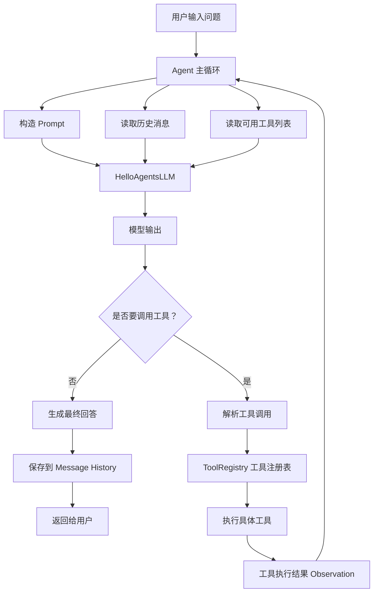

```mermaid
flowchart TD
    A[用户输入问题] --> B[构建 Prompt<br/>工具描述 + 问题 + 历史记录]
    B --> C[调用 LLM think]
    C --> D{解析输出}
    
    D -->|Thought + Action| E{Action 类型?}
    D -->|解析失败| F[⚠️ 流程终止]
    
    E -->|Finish[答案]| G[🎉 返回最终答案]
    E -->|工具调用[参数]| H[执行工具]
    H --> I[获取 Observation]
    I --> J[记录到历史记录]
    J --> B
    
    style A fill:#e1f5fe
    style C fill:#fff3e0
    style G fill:#c8e6c9
    style F fill:#ffcdd2
    style H fill:#f3e5f5
```
